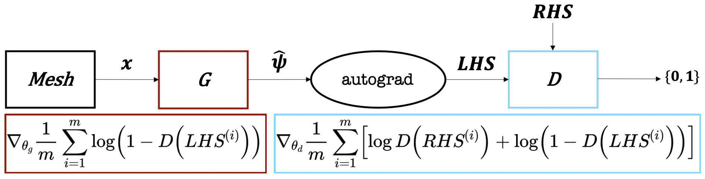

# Neural Networks for *Solving* Differential Equations

We aspire to solve differential equations (i.e. equations described by differences, such as derivatives) as they are of significant engineering and scientific interest. We take a (somewhat) new approach and employ neural networks (universal function approximators) to the problem of *learning the solution* as a function. This is in contrast to numerical methods (such as finite differences or finite elements) which solve the system at a set of points. Indeed, since the solutions to differential equations *are functions*, we believe that this is altogether not an entirely unreasonable idea.

# Installation

**On Mac OS:**
- `conda env create -f environment.yml`
- `conda activate denn`
- `python setup.py install`

**On Linux:**
- `conda env create -f linux_environment.yml`
- `conda activate denn`
- `python setup.py install`

# Organization

This is primarily a *research code* which I have developed to investigate and solve a variety of problems. It includes:
1. Investigations into classic L2 norm-based neural network methods on Reynolds-Averaged Navier Stokes equations (specifically targeting channel flow). This work can be referenced in `notebooks/rans` and the associated source code in `denn/rans`.
2. The development (and plethora of divergences due to unexpected behavior) of a Generative Adversarial Network (GAN)-based approach applied to a variety of problems, e.g. exponential decay (`exp`), harmonic oscillator (`sho`), nonlinear oscillator (`nlo`). GANs are very hard to train and, in fact, have no guarantee of convergence (unlike normal neural networks trained with gradient descent). This is meant to be an investigation into an idea rather than a highly performant code for solving differential equations.

# GAN Approach (DEQGAN)

Here is a diagram that describes the high-level idea behind the approach we employ for training the GAN to solve the equation.

The idea is that we use a discriminator to "learn the loss function" used to evaluate the generator's solutions. We found that this can often lead to orders of magnitude increases in accuracy, but at the cost of instability/variability (some random initializations perform much worse than a standard method).

Paper is in progress.
